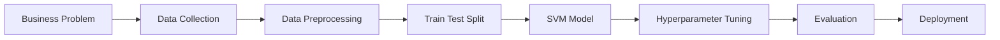

<div align="center">

# 🧠 CASE STUDY: EMPLOYEE ATTRITION PREDICTION USING SVM


<br><br>


<br>

## 📘 Complete SVM Case Study

[](https://drive.google.com/file/d/1bSiN7wIR_A-FfAJzS5cZVb_I1GmuxsdG/view)

<br>

### 🚀 Predicting Employee Attrition Using Machine Learning

*"Helping HR teams identify employees at risk of leaving before resignation happens."*

</div>

---

# 📚 Table of Contents

* 🎯 Business Problem
* 📊 Dataset Overview
* 🧠 How SVM Works
* ⚙️ Project Workflow
* 🧹 Data Preprocessing
* 🤖 Model Training
* 🎛 Hyperparameter Tuning
* 💻 Python Implementation
* 📈 Model Evaluation
* 💰 Business Impact
* 🌍 Real-World Applications
* 🎓 Key Takeaways

---

# 📄 Complete Case Study PDF

<div align="center">

<a href="https://drive.google.com/file/d/1YfadwWK96eG06JnVawixaf_XPRdvgCqm/view?usp=sharing">

</a>

</div>

---

# 🎯 Business Problem

> TechNova Solutions is facing increasing employee attrition.

Every month, skilled employees leave the organization, resulting in:

💰 Recruitment Costs

📚 Training Expenses

📉 Productivity Loss

⏳ Project Delays

### Goal

Predict whether an employee will:

| Class | Meaning         |
| ----- | --------------- |
| 🟢 0  | Employee Stays  |
| 🔴 1  | Employee Leaves |

This allows HR teams to intervene early and improve retention.

---

# 📊 Dataset Overview

## Employee Information

| Feature             | Description          |
| ------------------- | -------------------- |
| 👤 Age              | Employee Age         |
| 💰 Salary           | Monthly Salary       |
| 📅 Experience       | Years of Experience  |
| ⏰ Overtime          | Yes / No             |
| 😊 Job Satisfaction | Scale (1–10)         |
| 🏠 Distance         | Distance from Office |
| 🎯 Promotion        | Promotion Last Year  |
| 🚪 Attrition        | Target Variable      |

---

# 🧠 How SVM Works

Imagine two islands.

🏝 Employees who Stay

🏝 Employees who Leave

SVM's objective is to create the safest possible boundary between both groups.

## Core Concepts

### 🔹 Hyperplane

Decision boundary separating classes.

### 🔹 Margin

Distance between classes.

### 🔹 Support Vectors

Critical points closest to the boundary.

These points determine the final position of the hyperplane.

---

# ⚙️ Project Workflow



---

# 🧹 Data Preprocessing

### Steps Performed

* ✅ Missing Value Handling
* ✅ Label Encoding
* ✅ Feature Scaling
* ✅ Standardization

### Why Scaling?

SVM uses distances.

Without scaling:

```text
Salary = 90000
Age = 25
```

Salary dominates the model.

With StandardScaler:

```text
Mean = 0
Standard Deviation = 1
```

All features contribute fairly.

---

# 🤖 Model Training

## Linear SVM

```python
SVC(kernel='linear')
```

### Best For

* Simple datasets
* Linearly separable data

---

## RBF Kernel SVM

```python
SVC(kernel='rbf')
```

### Best For

* Complex patterns
* Non-linear relationships
* Real-world datasets

---

# 🎛 Hyperparameter Tuning

## C Parameter

| Small C          | Large C          |
| ---------------- | ---------------- |
| More Margin      | Less Margin      |
| Less Overfitting | More Overfitting |

---

## Gamma Parameter

| Small Gamma      | Large Gamma      |
| ---------------- | ---------------- |
| Smooth Boundary  | Complex Boundary |
| Less Overfitting | More Overfitting |

### Optimization

```python
GridSearchCV()
```

Used to find the best values of:

* C
* Gamma

---

# 💻 Python Implementation

```python
from sklearn.svm import SVC
from sklearn.model_selection import train_test_split
from sklearn.metrics import accuracy_score

X_train, X_test, y_train, y_test = train_test_split(
    X,
    y,
    test_size=0.2,
    random_state=42
)

model = SVC(
    kernel='rbf',
    C=10,
    gamma=0.1
)

model.fit(X_train, y_train)

predictions = model.predict(X_test)

print(
    accuracy_score(
        y_test,
        predictions
    )
)
```

---

# 📈 Model Evaluation

### Confusion Matrix

| Actual / Predicted | Stay | Leave |
| ------------------ | ---- | ----- |
| Stay               | TN   | FP    |
| Leave              | FN   | TP    |

### Metrics

```text
Accuracy  = (TP + TN) / Total

Precision = TP / (TP + FP)

Recall    = TP / (TP + FN)

F1 Score  = 2 × Precision × Recall
            ----------------------
            Precision + Recall
```

---

# 💰 Business Impact

## Before Machine Learning

❌ Employee resigns

❌ HR reacts too late

❌ Higher recruitment cost

❌ Lower productivity

---

## After SVM Deployment

✅ Predict risk early

✅ Improve retention

✅ Save recruitment cost

✅ Better workforce planning

✅ Happier employees

---

# 🌍 Real-World Applications

| Industry           | Application          |
| ------------------ | -------------------- |
| 🏥 Healthcare      | Disease Prediction   |
| 💳 Finance         | Fraud Detection      |
| 🛒 Retail          | Customer Churn       |
| 🔒 Cybersecurity   | Intrusion Detection  |
| 📰 NLP             | Sentiment Analysis   |
| 🎥 Computer Vision | Face Recognition     |
| 👨‍💼 HR Analytics | Attrition Prediction |

---

# 🎓 Key Takeaways

> ⭐ SVM is one of the most powerful classification algorithms.

✔ Works well on structured data

✔ Effective for binary classification

✔ Uses Support Vectors

✔ Maximizes Margin

✔ Performs well on small-to-medium datasets

✔ Widely used in industry

---

<details>
<summary><b>📚 Quick Revision Notes</b></summary>

### Remember

* SVM = Supervised Learning
* Uses Hyperplane
* Uses Support Vectors
* RBF is most common Kernel
* Scaling is mandatory
* Great for Classification Tasks

</details>

---

<div align="center">

## 👨‍💻 Author

### Ram Krishna Sahoo

🎓 MCA (AIML)

🚀 AI & Machine Learning Enthusiast

📊 Data Science Learner

⭐ If this case study helped you, consider starring the repository.


</div>

</div>
